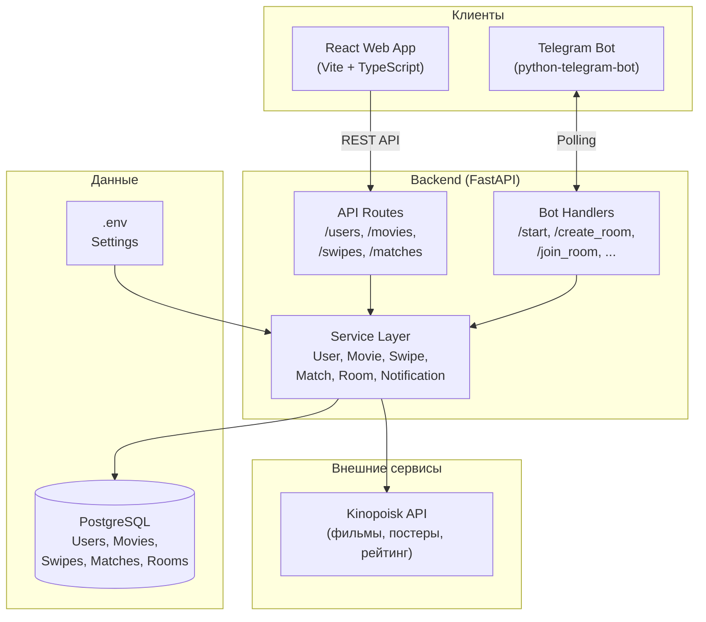

# 🍿 Movie Tinder Bot

Telegram-бот + веб-приложение для совместного выбора фильмов в группе друзей. Участники асинхронно свайпают карточки фильмов, а система находит совпадения, когда **все** участники группы лайкают один и тот же фильм.

## Архитектура



### Принцип работы

1. **Комнаты** — пользователи объединяются через Telegram-бот (`/create_room`, `/join_room`)
2. **Свайпы** — каждый участник через веб-приложение свайпает фильмы независимо
3. **Матчинг** — когда **все** участники комнаты лайкают один фильм, создаётся матч
4. **Уведомление** — бот отправляет сообщение о найденном матче всем участникам

## Структура проекта

```
tinder_movie/
├── backend/                        # Python backend (FastAPI)
│   ├── app/
│   │   ├── api/                    # REST API endpoints
│   │   │   ├── users.py            #   Пользователи
│   │   │   ├── movies.py           #   Фильмы
│   │   │   ├── swipes.py           #   Свайпы
│   │   │   ├── matches.py          #   Матчи
│   │   │   └── schemas.py          #   Pydantic-схемы
│   │   ├── bot/
│   │   │   └── handlers.py         # Telegram bot command handlers
│   │   ├── models/                 # SQLAlchemy ORM models
│   │   │   ├── user.py
│   │   │   ├── movie.py
│   │   │   ├── swipe.py
│   │   │   ├── match.py
│   │   │   └── room.py
│   │   ├── services/               # Бизнес-логика (singletons)
│   │   │   ├── user_service.py
│   │   │   ├── movie_service.py
│   │   │   ├── swipe_service.py
│   │   │   ├── match_service.py
│   │   │   ├── room_service.py
│   │   │   └── notification_service.py
│   │   ├── migrations/             # Alembic миграции
│   │   │   ├── env.py
│   │   │   └── versions/
│   │   ├── scripts/                # Утилиты и скрипты
│   │   │   ├── verify_user_insert.py
│   │   │   ├── test_kinopoisk_api.py
│   │   │   └── update_movies_from_kinopoisk.py
│   │   ├── main.py                 # Точка входа (FastAPI app)
│   │   ├── config.py               # Настройки (pydantic-settings)
│   │   ├── database.py             # SQLAlchemy engine & session
│   │   └── logging_config.py       # Конфигурация логирования
│   ├── requirements.txt
│   └── tests/                      # Тесты (пока пусто)
│
├── frontend/                       # React мини-приложение (Vite + TS)
│   ├── src/
│   │   ├── components/
│   │   │   └── MovieCard.tsx       # Свайпаемая карточка фильма
│   │   ├── services/
│   │   │   └── api.ts              # API-клиент (Axios + case conversion)
│   │   ├── types/
│   │   │   └── movie_types.ts      # TypeScript интерфейсы
│   │   ├── App.tsx                 # Главный компонент (state + логика)
│   │   ├── App.css
│   │   ├── index.css               # Глобальные стили + CSS-переменные
│   │   └── main.tsx                # Entry point
│   ├── index.html
│   ├── vite.config.ts
│   ├── tailwind.config.ts
│   ├── tsconfig.json
│   ├── package.json
│   └── .env.example
│
├── alembic.ini                     # Alembic config (корневой)
└── README.md
```

## Модули и ответственность

### Backend

#### Основные файлы

| Файл | Ответственность |
|------|-----------------|
| `app/main.py` | Точка входа: создание FastAPI-приложения, CORS middleware, роутеры, условный запуск бота |
| `app/config.py` | Загрузка переменных окружения через `pydantic-settings` (БД, Redis, бот, Kinopoisk, CORS, JWT, бизнес-лимиты) |
| `app/database.py` | SQLAlchemy: engine, session factory, `Base`, dependency `get_db()` |
| `app/logging_config.py` | Логирование: console + rotating file (`app.log`, `errors.log`) |

#### API (`app/api/`)

REST-эндпоинты для веб-приложения. Тонкий слой — валидация input, вызов сервис, обёртка в `ApiResponse`.

| Модуль | Эндпоинты | Описание |
|--------|-----------|----------|
| `users.py` | `POST /api/users/`, `GET /api/users/id/{id}`, `GET /api/users/telegram_id/{telegram_id}` | CRUD пользователей |
| `movies.py` | `GET /api/movies/random`, `GET /api/movies/{id}` | Случайный фильм для свайпа / конкретный фильм. Автозагрузка из Kinopoisk при нехватке |
| `swipes.py` | `POST /api/swipes/`, `GET /api/swipes/user/{user_id}` | Создание свайпа (like/dislike) с проверкой матча |
| `matches.py` | `GET /api/matches/group`, `GET /api/matches/{match_id}`, `GET /api/matches/vote-status` | Матчи группы, статус голосования |
| `schemas.py` | — | Pydantic-схемы: `ApiResponse[T]`, `UserCreate`, `SwipeCreate`, `MovieResponse`, `MatchResponse`, `VoteStatusResponse` |

#### Bot (`app/bot/`)

| Модуль | Описание |
|--------|----------|
| `handlers.py` | Команды Telegram: `/start` (регистрация), `/help`, `/create_room`, `/join_room <CODE>`, `/leave_room`, `/room_info`. Авто-регистрация пользователей. Запуск через `run_polling()` |

#### Services (`app/services/`)

Бизнес-логика. Каждый сервис — singleton, вызывается из API и бота.

| Сервис | Описание |
|--------|----------|
| `user_service` | CRUD пользователей: создание, поиск по ID/telegram_id, bulk lookup, обновление имени, удаление |
| `movie_service` | CRUD фильмов, случайная выборка, автозагрузка из Kinopoisk API (при падении ниже порога), ротация старых фильмов, fetch деталей фильма |
| `swipe_service` | Создание свайпов (idempotent upsert), список свайпов пользователя, `check_match` — проверка, лайкнули ли все участники группы один фильм |
| `match_service` | Создание матчей (idempotent), список матчей группы, получение по ID, отметка `is_notified` |
| `room_service` | Жизненный цикл комнат: генерация 6-символьных кодов, создание/вход/выход, информация о комнате с участниками, поиск комнаты пользователя. Лимит: макс. 5 человек |
| `notification_service` | Отправка уведомлений о матче всем участникам через Telegram. Работает в фоне (отдельный поток + asyncio event loop) |

#### Models (`app/models/`)

SQLAlchemy ORM-модели.

| Модель | Таблица | Описание |
|--------|---------|----------|
| `User` | `users` | Telegram-пользователь: UUID PK, `telegram_id` (unique), `username`, `first_name`, `last_active` |
| `Movie` | `movies` | Фильм из Kinopoisk: UUID PK, `kinopoisk_id`, название, год, жанр, постер, описание, рейтинг |
| `UserSwipe` | `user_swipes` | Свайп: пользователь + фильм + тип (like/dislike) + участники группы. Unique constraint для идемпотентности |
| `Match` | `matches` | Матч: фильм + участники группы + `is_notified`. GIN index для JSON-запросов |
| `Room` | `rooms` | Комната: 6-символьный код PK, создатель, участники (JSON array telegram_ids) |

#### Migrations (`app/migrations/`)

Alembic миграции для управления схемой БД.

| Миграция | Описание |
|----------|----------|
| `2025_09_25_1200_initial.py` | Создание таблиц: `users`, `movies`, `user_swipes`, `matches` + enum `swipe_type` |
| `2025_12_06_1400_add_rooms_table.py` | Добавление таблицы `rooms` |

#### Scripts (`app/scripts/`)

| Скрипт | Описание |
|--------|----------|
| `verify_user_insert.py` | Создание тестового пользователя (telegram_id=999000111) для проверки подключения к БД |
| `test_kinopoisk_api.py` | Тест Kinopoisk API — fetch фильма (по умолчанию Matrix, ID 301) |
| `update_movies_from_kinopoisk.py` | Обновление фильмов без постеров + добавление 5 хардкодированных популярных фильмов |

---

### Frontend

Одностраничное React-приложение (Vite + TypeScript + Tailwind CSS) для свайпа фильмов.

#### Основные файлы

| Файл | Описание |
|------|----------|
| `src/main.tsx` | Entry point: рендерит `<App />` в `#root` |
| `src/App.tsx` | Главный компонент: state (очередь фильмов, загрузка, ошибки), preload 5 фильмов, обработка свайпов, dev-утилита для Telegram ID |
| `src/index.css` | Глобальные стили: CSS-переменные (shadcn-паттерн), HSL-цвета, dark mode, кастомные анимации |

#### Компоненты

| Компонент | Описание |
|-----------|----------|
| `components/MovieCard.tsx` | Свайпаемая карточка фильма: touch-жесты (drag threshold 100px), визуальная обратная связь (rotation, сдвиг), индикаторы "ЛАЙК"/"ПРОПУСК", glass-morphism UI, кнопки действий, раскрывающееся описание |

#### Сервисы

| Модуль | Описание |
|--------|----------|
| `services/api.ts` | API-клиент на Axios: interceptors (логирование, case conversion `snake_case` ↔ `camelCase`), типизированные методы (`getRandomMovie()`, `createSwipe()`), таймаут 10s |

#### Типы

| Файл | Описание |
|------|----------|
| `types/movie_types.ts` | TypeScript-интерфейсы: `Movie`, `SwipeVote`, `GetRandomMovieResponse`, `VoteResponse`, `SessionToken`, `SwipeResponse` |

#### Конфигурация

| Файл | Описание |
|------|----------|
| `vite.config.ts` | Vite: React plugin, proxy `/api/*` → `http://localhost:8000` |
| `tailwind.config.ts` | Tailwind: shadcn-тема, dark mode (`class`), кастомные цвета, анимации, `tailwindcss-animate` |
| `tsconfig.json` | Root TS config с project references |
| `eslint.config.js` | ESLint: `@eslint/js`, `typescript-eslint`, `eslint-plugin-react-hooks`, `eslint-plugin-react-refresh` |

---

## Технологический стек

| Слой | Технологии |
|------|-----------|
| **Backend** | Python 3.12+, FastAPI, SQLAlchemy 2.0, Alembic, PostgreSQL, python-telegram-bot |
| **Frontend** | React 19, TypeScript 5.9, Vite 7, Tailwind CSS 3, Axios, Lucide React |
| **Внешние API** | Kinopoisk API (фильмы, постеры, метаданные) |
| **Деплой** | Docker, Docker Compose |

---

## Команды бота

### 🚀 Основные
- `/start` — регистрация пользователя
- `/help` — справка

### 🏠 Комнаты
- `/create_room` — создать комнату для группы
- `/join_room <КОД>` — войти в комнату по коду
- `/leave_room` — выйти из текущей комнаты
- `/room_info` — информация о комнате и участниках

### 💡 Как пользоваться

**Два пользователя:**
```
👤 Вова:    /create_room
🤖 Бот:     "Комната создана! Код: ABC123"

👤 Мария:   /join_room ABC123
🤖 Бот:     "Вы вошли в комнату ABC123!"

Оба открывают мини-приложение и свайпают фильмы.
Матч — когда оба лайкнули один фильм.
```

**Группа 3+:**
1. Один создаёт комнату
2. Остальные входят по коду
3. Все видят одинаковые фильмы
4. Матч = **все** лайкнули один фильм

---

## Запуск на локалхосте

1. **Запускаешь БД:**
   - `brew services start postgresql@14`
   - `psql -U lotreamaun -d tinder_movie_dev`
2. **Запускаешь FastAPI:**
   - `uvicorn app.main:app --reload` (из папки `backend/`)
3. **Запускаешь frontend:**
   - `npm run dev` (из папки `frontend/`)

---

## Лицензия

MIT License
